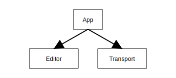

# OpenDAW Studio

This package contains the web-based user interface for the OpenDAW project.

For a guided overview of the interface, see the [UI tour](../../docs/docs-user/ui-tour.md).

## Component Hierarchy

Developers can extend the Studio with custom devices and user interfaces. Learn how to build and test plugins in the [developer docs](../../docs/docs-dev/extending/plugin-guide.md).
