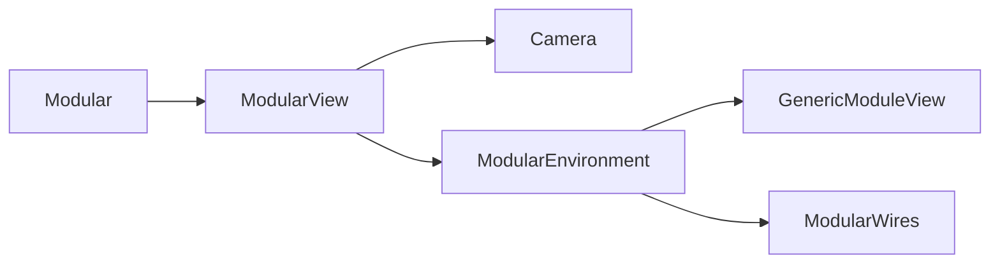
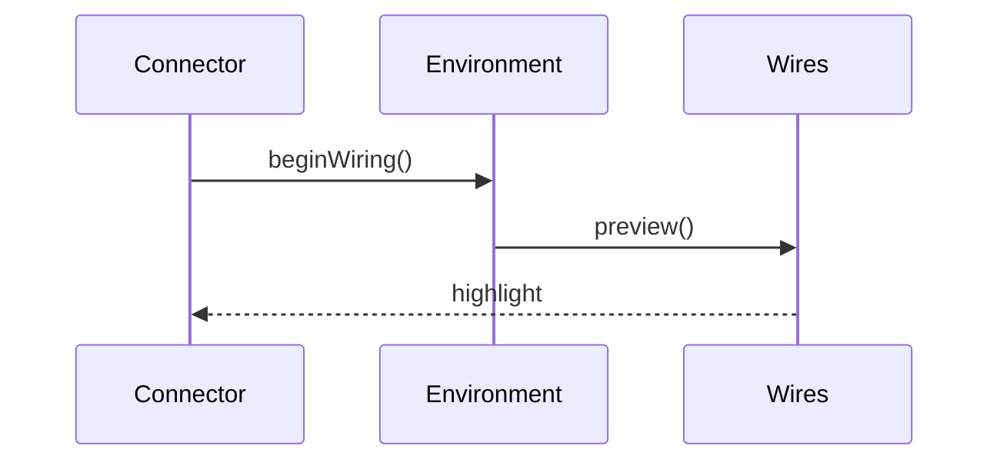

# Modular UI

This directory contains the modular workspace used in the studio
application. Modules can be arranged visually and connected with
wires to build custom signal flows.

## Architecture

## Wiring lifecycle

