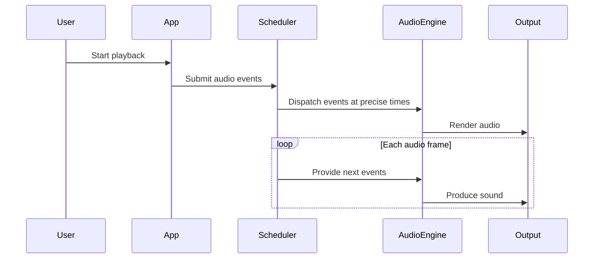
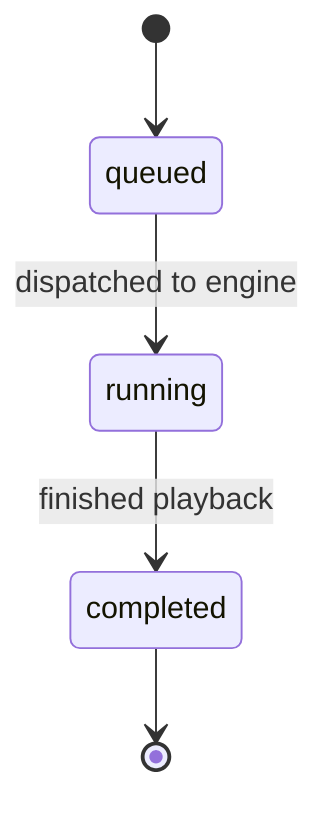

# Audio Path and Scheduler

The sequence below shows how audio events travel through the system.

## Scheduler States

The scheduler manages the lifecycle of events as they move from being submitted to the moment they are processed.

Events enter the **queued** state when the app submits them to the scheduler. At their scheduled time they move to the **running** state as the scheduler dispatches them to the audio engine. Once an event has been processed by the audio engine it reaches the **completed** state, leaving the scheduler's active set.

