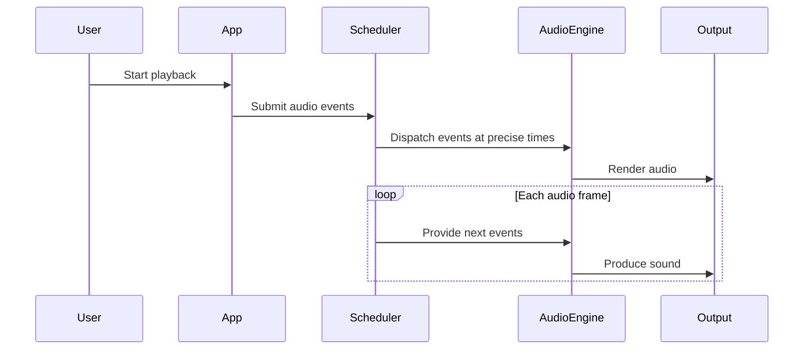

# Audio Path and Scheduler

The sequence below shows how audio events travel through the system.

```mermaid
sequenceDiagram
    participant User
    participant App
    participant Scheduler
    participant AudioEngine
    participant Output

    User->>App: Start playback
    App->>Scheduler: Submit audio events
    Scheduler->>AudioEngine: Dispatch events at precise times
    AudioEngine->>Output: Render audio
    loop Each audio frame
        Scheduler->>AudioEngine: Provide next events
        AudioEngine->>Output: Produce sound
    end
```
