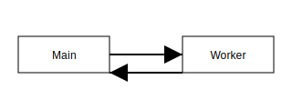

# Audio Path and Scheduler

openDAW's timing engine lives in
[`@opendaw/studio-core`](../package-inventory.md#studio). The sequence below
shows how audio events travel through the system.

## Scheduler States

The scheduler manages the lifecycle of events as they move from being submitted to the moment they are processed.

Events enter the **queued** state when the app submits them to the scheduler. At their scheduled time they move to the **running** state as the scheduler dispatches them to the audio engine. Once an event has been processed by the audio engine it reaches the **completed** state, leaving the scheduler's active set.

See the [architecture overview](./overview.md) for the big picture and
the [performance guide](../performance.md) for profiling tips.

## Worker Lifecycle

The shared worker is installed during application startup, becomes active while
providing services to the audio engine and is terminated when the session ends.
See the [studio core README](../../../studio/core/README.md) for an
overview of the engine components involved in this flow.
