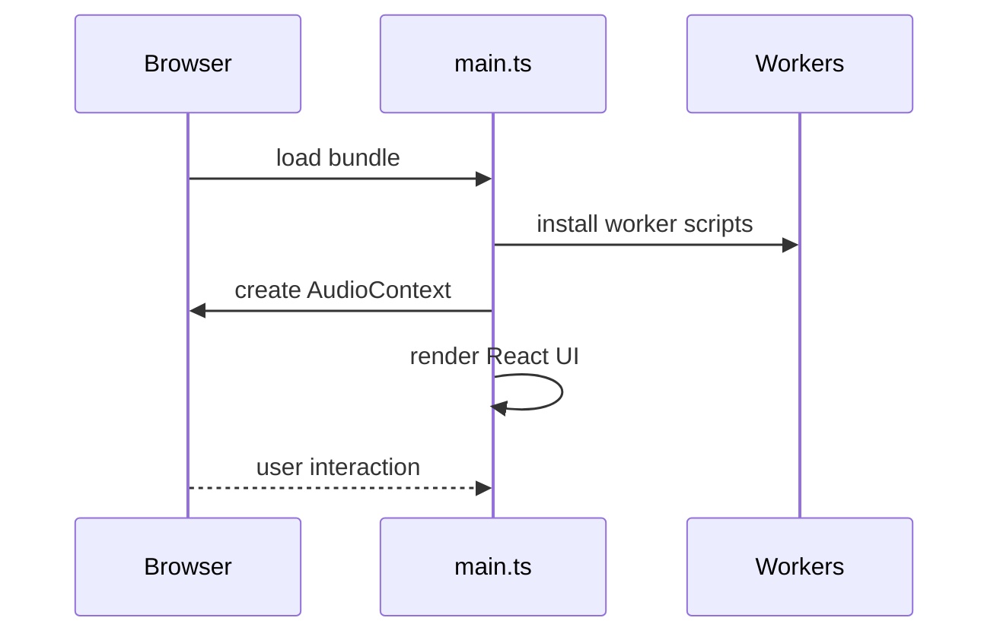
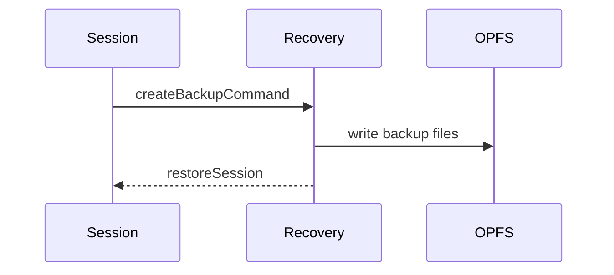

# Bootstrapping

The boot process of openDAW initialises background services and prepares
the UI before a project is loaded. It builds upon the architecture
outlined in the [overview](./overview.md) and provides context for the
user‑facing [Quick Start guide](../../docs-user/quick-start.md). The
`App` component mounts the top‑level UI and router, `BuildInfo` verifies
cached assets, and the `Recovery` service persists temporary session
state to the Origin Private File System (OPFS).

## Application startup

## Session recovery

The recovery flow persists the active project to the origin private file
system so that the state can be restored after an unexpected shutdown.
