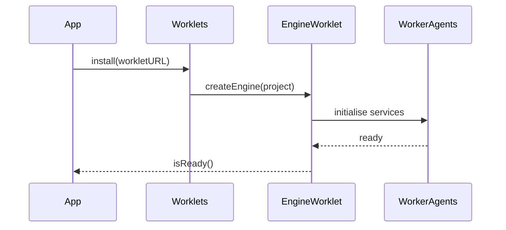
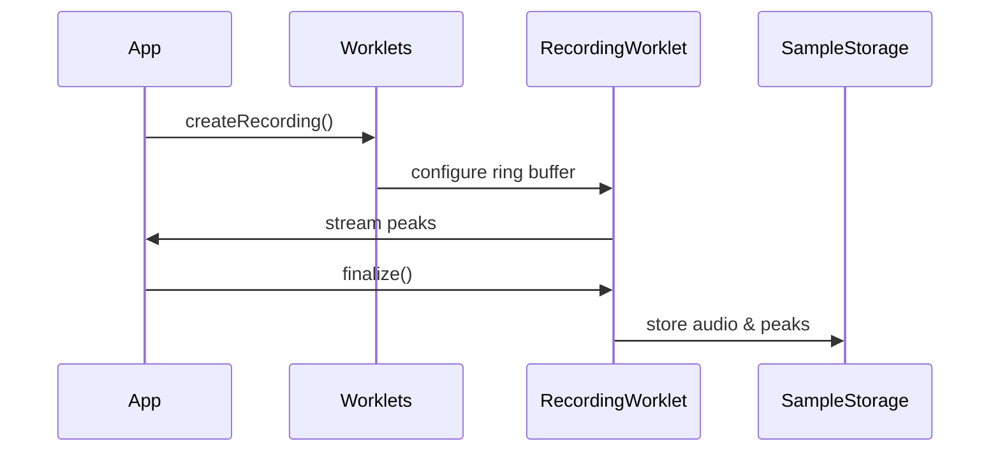

# Engine Sequence Diagrams

The studio engine coordinates audio worklets and worker agents to render and record audio. The following sequences illustrate key interactions.

## Engine Startup

## Recording Flow

For a broader view of the system see the [architecture overview](./overview.md).

