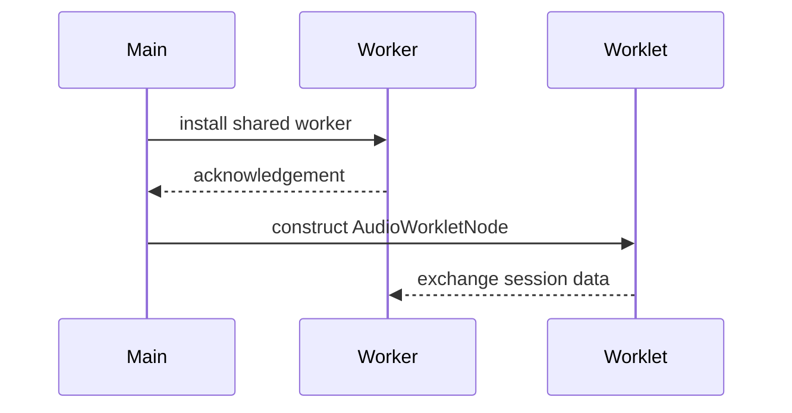
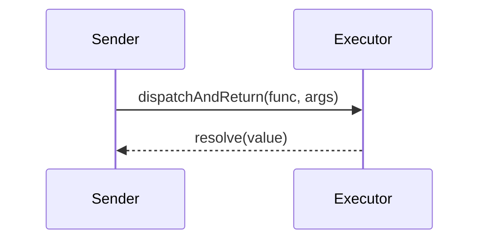

# Messaging

openDAW components communicate across thread and process boundaries using
light‑weight messaging abstractions built on top of the browser's
`postMessage` API.  The runtime's {@link packages/lib/runtime/src/messenger.ts | `Messenger`}
wraps `MessagePort`‑like endpoints and the {@link packages/lib/runtime/src/communicator.ts | `Communicator`}
layer adds a small RPC mechanism.

## Channels and Workers

## Remote Calls

Messages are structured cloned, so objects with methods or private fields lose
behaviour when transferred.  Always validate messages received from other
contexts and prefer passing plain data objects.
