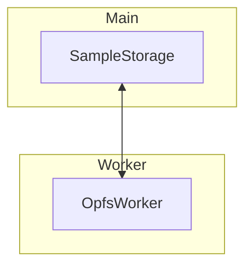

# OPFS Sample Storage

The studio caches imported and cloud hosted audio files in the browser's
[Origin Private File System](https://developer.mozilla.org/docs/Web/API/File_System_Access_API/Origin_private_file_system).
The `SampleStorage` service stores raw audio data under `samples/` and exposes
utilities for lookup by UUID.

## Worker Protocol

File system access happens inside a dedicated web worker. The worker implements
an `OpfsProtocol` with basic `write`, `read`, `delete` and `list` operations.
The host registers the protocol via `OpfsWorker.init` and communicates through a
`Messenger` channel to serialize file system operations.

## Integration

`SampleBrowser` and `SampleService` combine the worker backed `SampleStorage`
with the remote `SampleApi`. Local samples live in OPFS while cloud entries are
fetched on demand and can be imported into the local cache.

For a higher level overview see the [persistence
architecture](./persistence.md).

