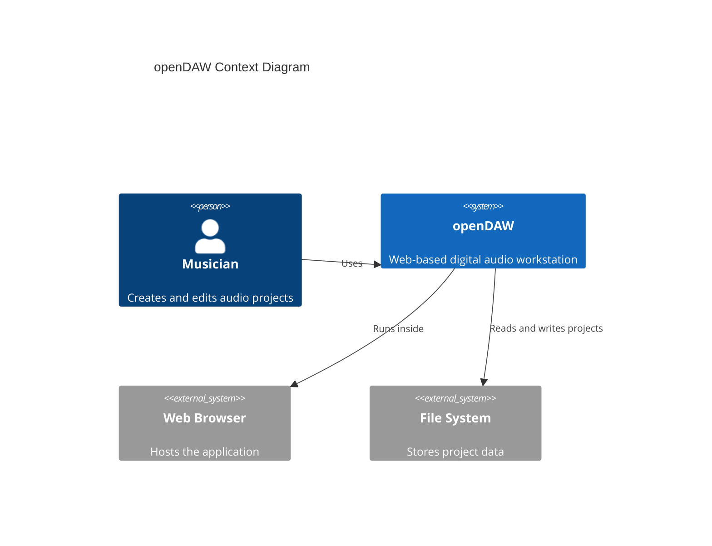
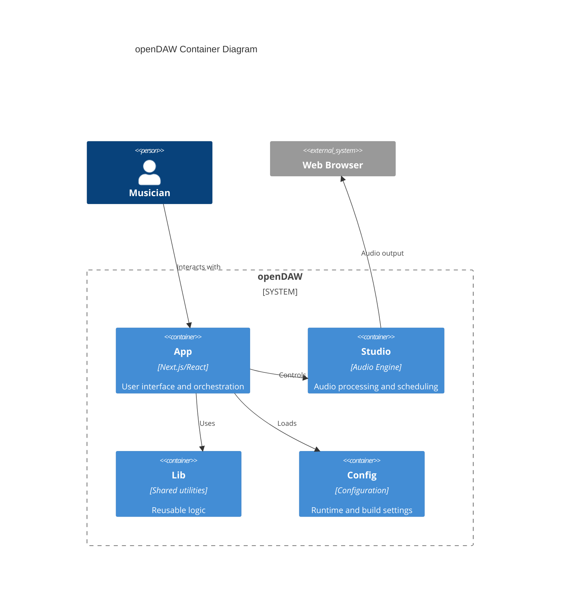
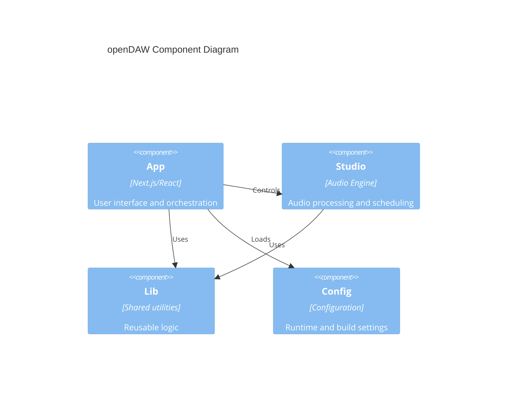
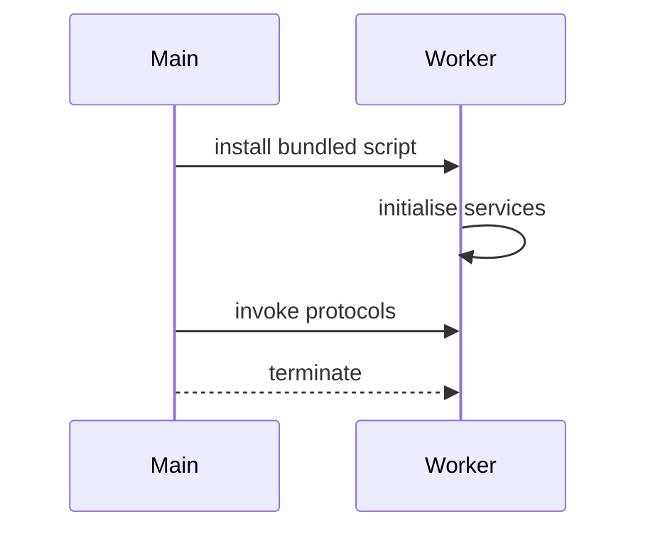
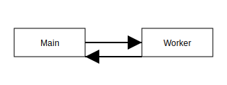

# Architecture Overview

openDAW is composed of several packages such as
[`@opendaw/app-studio`](../package-inventory.md#app) and
[`@opendaw/studio-core`](../package-inventory.md#studio). The architecture is
described using the C4 model. For a step‑by‑step look at how the
application starts, see the [bootstrapping sequence](./bootstrap.md). Refer to
the [project roadmap](../../../../ROADMAP.md) for milestone context.

Static assets like the abstract SVG set in
`packages/app/studio/public/viscious-speed` are bundled with the app; see that
folder's README for a complete list and licensing details.

## Context

## Containers

## Components

- **App** – Provides the user interface and coordinates system interactions. Implemented in
  [`@opendaw/app-studio`](../package-inventory.md#app).
- **Studio** – Handles audio processing, scheduling, and engine control. Powered by
  [`@opendaw/studio-core`](../package-inventory.md#studio).
- **Lib** – Supplies shared utilities and reusable logic across modules from packages like
  [`@opendaw/lib-runtime`](../package-inventory.md#lib).
- **Config** – Delivers runtime and build settings consumed by other components through
  [`@opendaw/eslint-config`](../package-inventory.md#config) and related packages.

For a deeper look at timing, see the [audio path](./audio-path.md), and
learn how to build the project in [Build and Run](../build-and-run/setup.md).

- **App** – Provides the user interface and coordinates system interactions.
- **Studio** – Handles audio processing, scheduling, and engine control.
- **Lib** – Supplies shared utilities and reusable logic across modules.
- **Config** – Delivers runtime and build settings consumed by other components.

Communication between these parts is based on lightweight message channels; see
the [messaging architecture](./messaging.md) for details.

## Worker Lifecycle

Workers are installed once at application startup and provide services such as
file access and waveform analysis before being terminated when no longer
needed.

For details about the studio runtime internals see the
[studio core README](../../../studio/core/README.md).

Developers integrating the engine can start with the [SDK overview](../sdk/overview.md).

Additional utilities for DOM interactions are described in the [DOM developer docs](../dom/overview.md).
