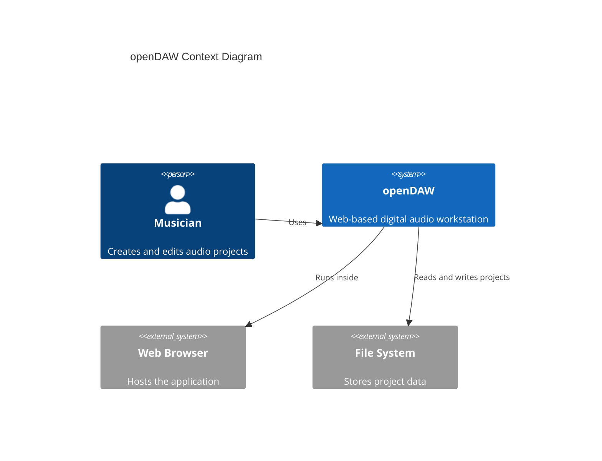
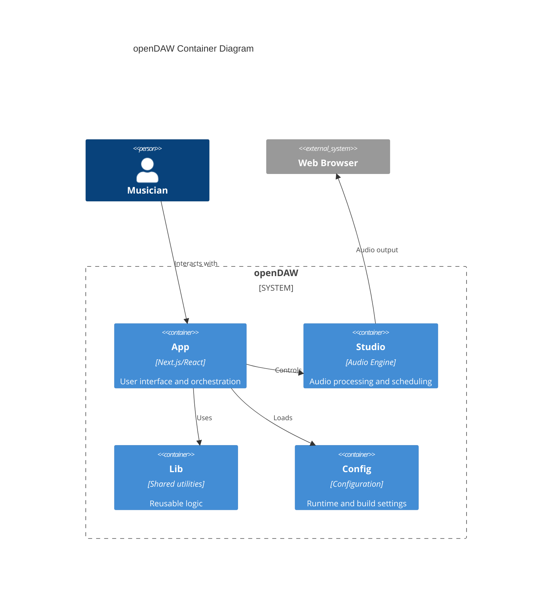

# Architecture Overview

The architecture of openDAW is described using the C4 model.

## Context

```mermaid
C4Context
    title openDAW Context Diagram
    Person(user, "Musician", "Creates and edits audio projects")
    System(system, "openDAW", "Web‑based digital audio workstation")
    System_Ext(browser, "Web Browser", "Hosts the application")
    System_Ext(files, "File System", "Stores project data")
    Rel(user, system, "Uses")
    Rel(system, browser, "Runs inside")
    Rel(system, files, "Reads and writes projects")
```

## Containers

```mermaid
C4Container
    title openDAW Container Diagram
    Person(user, "Musician")
    System_Boundary(opendaw, "openDAW") {
        Container(app, "App", "Next.js/React", "User interface and orchestration")
        Container(studio, "Studio", "Audio Engine", "Audio processing and scheduling")
        Container(lib, "Lib", "Shared utilities", "Reusable logic")
        Container(config, "Config", "Configuration", "Runtime and build settings")
    }
    System_Ext(browser, "Web Browser")
    Rel(user, app, "Interacts with")
    Rel(app, studio, "Controls")
    Rel(app, lib, "Uses")
    Rel(app, config, "Loads")
    Rel(studio, browser, "Audio output")
```
