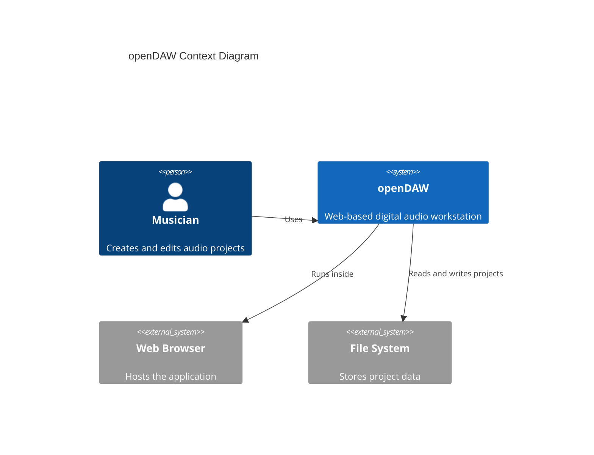
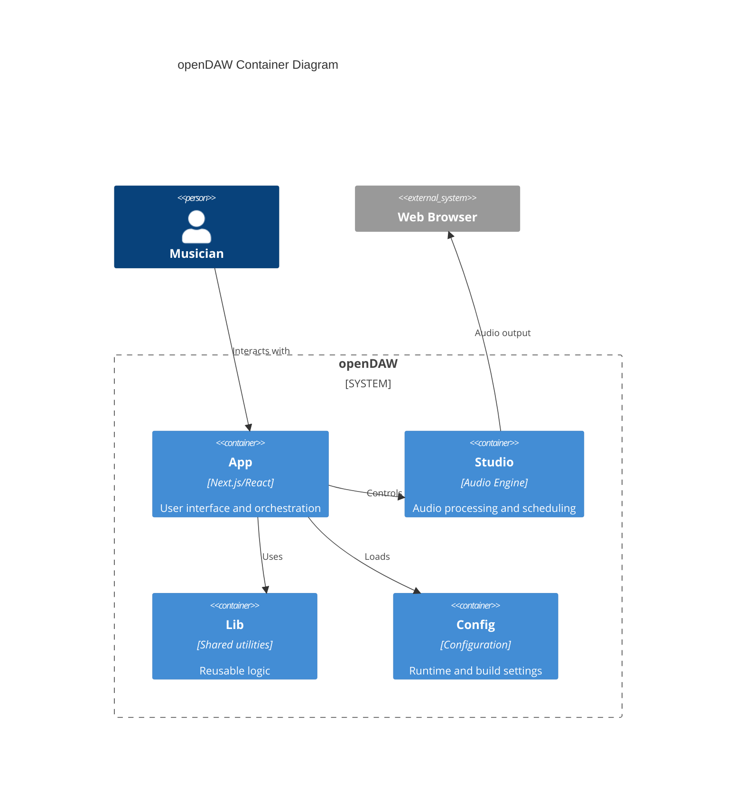
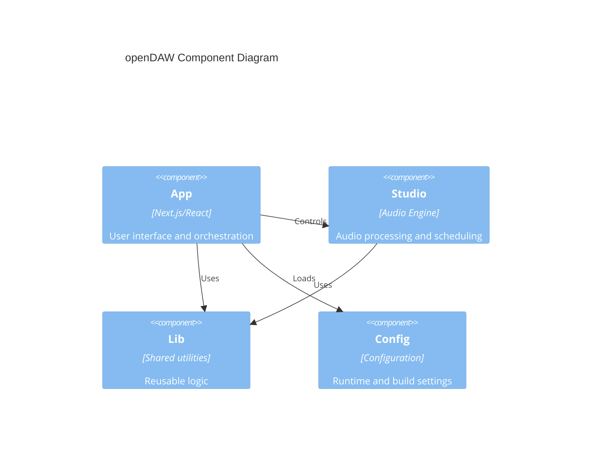
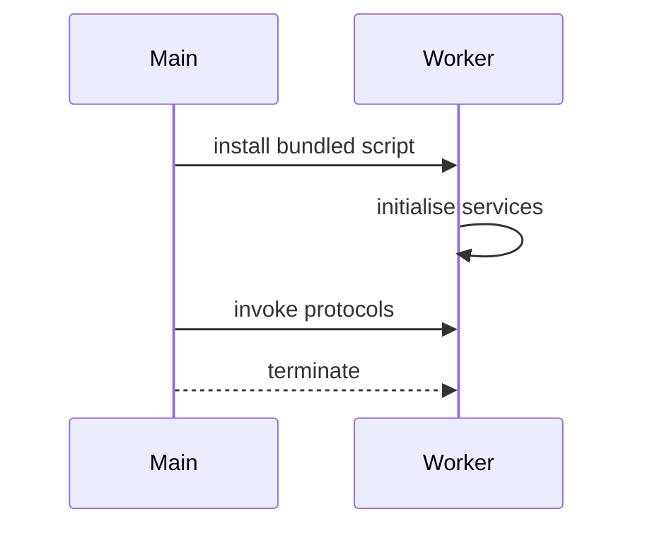

# Architecture Overview

The architecture of openDAW is described using the C4 model.

## Context

## Containers

## Components

- **App** – Provides the user interface and coordinates system interactions.
- **Studio** – Handles audio processing, scheduling, and engine control.
- **Lib** – Supplies shared utilities and reusable logic across modules.
- **Config** – Delivers runtime and build settings consumed by other components.

## Worker Lifecycle

Workers are installed once at application startup and provide services such as
file access and waveform analysis before being terminated when no longer
needed.
