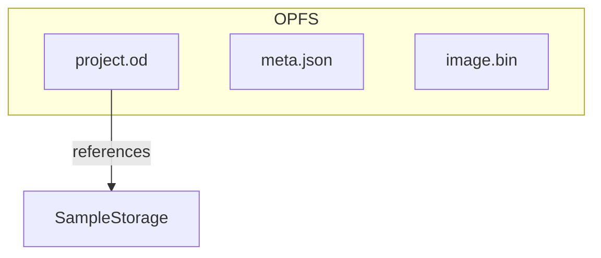

# Persistence

openDAW stores project data and samples in the browser using the Origin Private File System (OPFS). Each project resides in its own folder under `projects/v1/<uuid>` containing:

- `project.od` – serialized project graph
- `meta.json` – metadata such as title and tags
- `image.bin` – optional cover image

Sample files referenced by projects are managed via `SampleStorage` and can be packaged together with a project into a distributable bundle. Bundles are standard ZIP archives with a `uuid` marker and a `samples/` folder holding audio data.

The `Projects` utility provides functions for reading and writing these artifacts as well as creating and importing bundles.

For day‑to‑day usage tips see the
[file management guide](../../docs-user/features/file-management.md).

