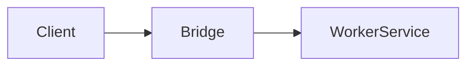

# Service Bridge

The service bridge coordinates communication between the user interface and
worker-hosted services. Both the Studio app and the headless demo rely on this
bridge to access long-running tasks in a dedicated thread.

`StudioService` delegates session management to `SessionService` over the
bridge, while network operations are throttled via
[`network.limitFetch`](../../../lib/runtime/src/network.ts).

See the [headless vs studio comparison](./headless-vs-studio.md) for how the
bridge enables feature parity across builds.
