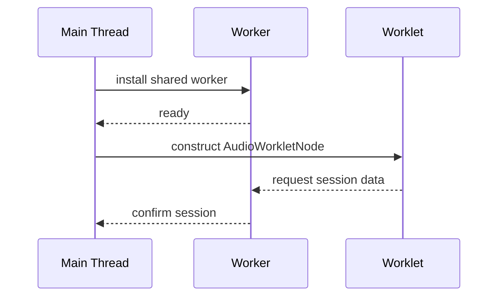

# Session Handshake

When a project session starts the application performs a small handshake
to synchronise the user interface, shared worker and audio worklet.  The
sequence ensures that all components operate on the same project state
before playback begins.

## Sequence

## Steps

1. `StudioService` boots the application and invokes
   `SessionService` to create or load a `ProjectSession`.
2. The runtime installs worker scripts and audio worklets via
   `WorkerAgents.install` and `Worklets.install`.
3. Session data is transferred to the engine through a
   [`Messenger`](../../../lib/runtime/src/messenger.ts) channel.
4. Both the worker and worklet acknowledge the active session
   before audio playback starts.

Security note: the handshake never leaves the browser process.  No
credentials or user data are transmitted over the network.
