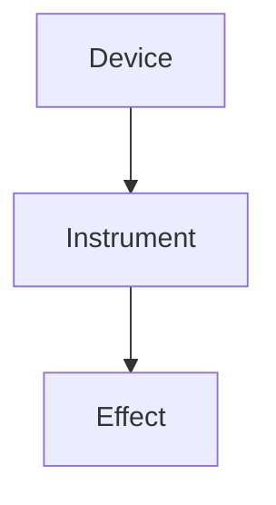

# Boxes Diagram

The following diagram illustrates the relationships between box groups.

```mermaid
graph TD
  Device --> Instrument
  Instrument --> Effect
```

Refer to the [`@opendaw/lib-box` README](../../../lib/box/README.md) for the
core graph concepts.
