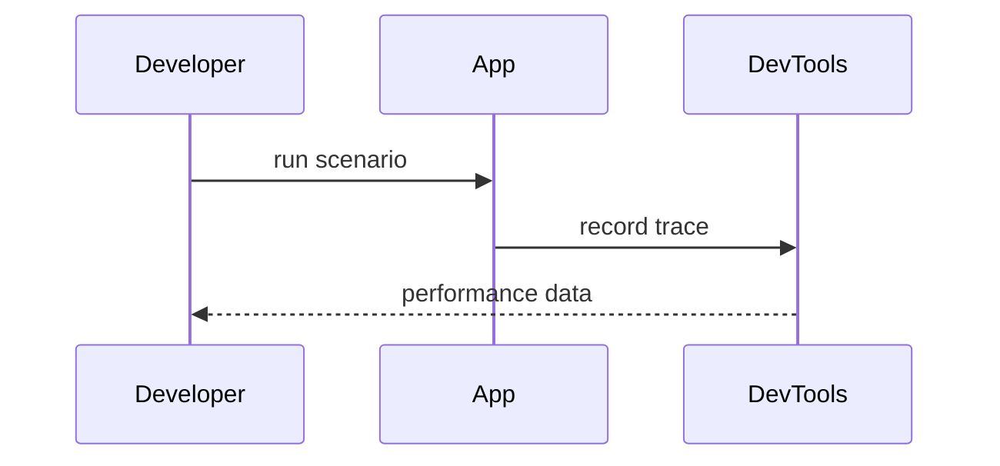

# Profiling

Profiling helps catch hot spots in packages like
[`@opendaw/lib-dsp`](../package-inventory.md#lib) and
[`@opendaw/app-studio`](../package-inventory.md#app).
Complete the [tests](./tests.md) before capturing profiles.

1. Open Chrome and launch the studio with `npm run dev:studio`.
2. In DevTools, switch to the **Performance** panel and start recording.
3. Interact with openDAW, then stop the recording to review CPU and audio
   statistics.

Refer to the [performance guide](../performance.md) for detailed screenshots and
hints.
