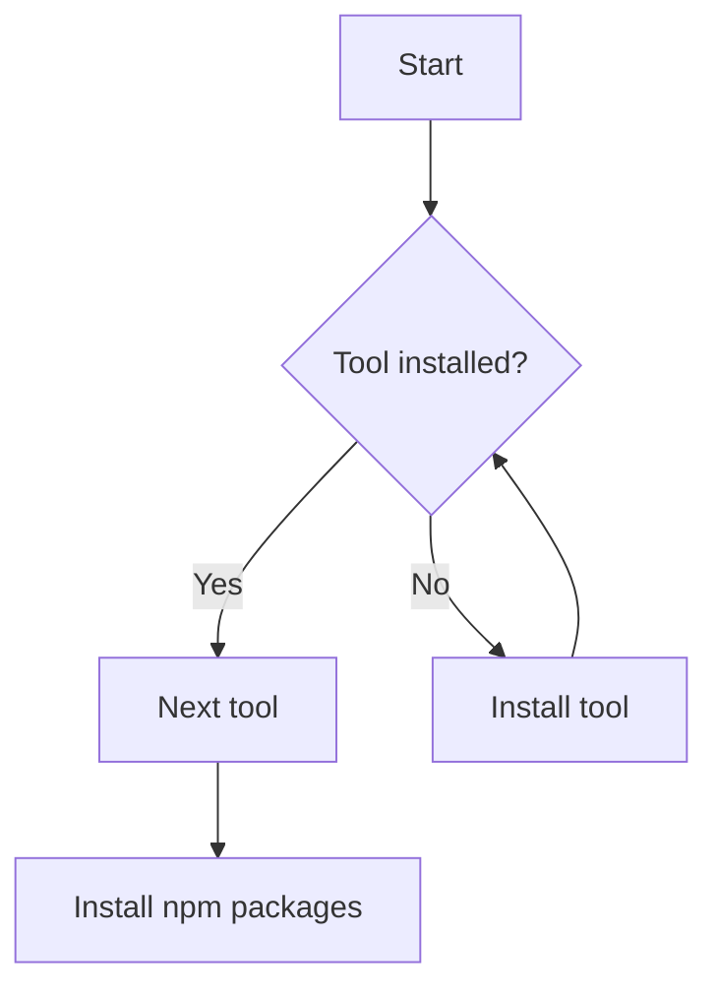
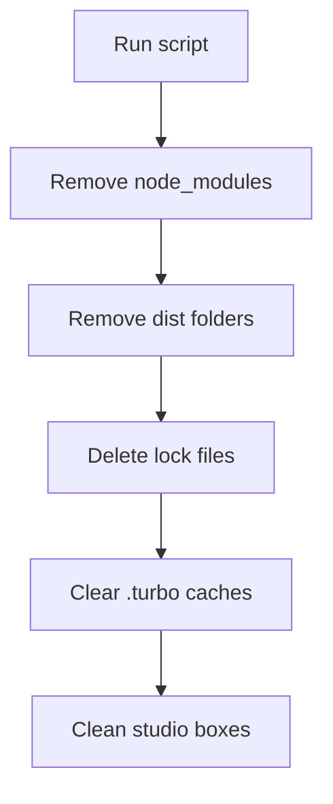

# Scripts

Helper scripts automate common setup tasks for the development environment.

## install_dependencies.js

Checks for required system tools and installs any that are missing, then runs
`npm install` for the workspace.

```bash
npm run install:deps
```



## cert.sh

Generates a trusted HTTPS certificate for `localhost` using mkcert.

```bash
npm run cert
```


## clean.sh

Removes build artifacts, lock files and `node_modules` to reset the workspace.

```bash
npm run clean
```



