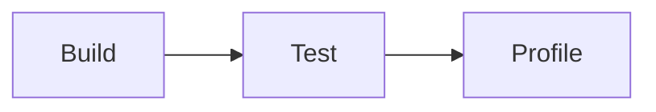

# Tests

After completing the [setup](./setup.md), verify that all packages build and
behave correctly by running the monorepo tests.

```bash
npm test
```

This command executes unit tests for packages such as
[`@opendaw/lib-runtime`](../package-inventory.md#lib) and
[`@opendaw/studio-core`](../package-inventory.md#studio).

For an overview of how test files are organized, see the
[Unit tests](../testing/unit-tests.md) guide.



If a test fails, consult the logs for the specific package. See
[Contributing](../contributing.md) for pull request guidelines and proceed to
[profiling](./profiling.md) to analyze performance.
