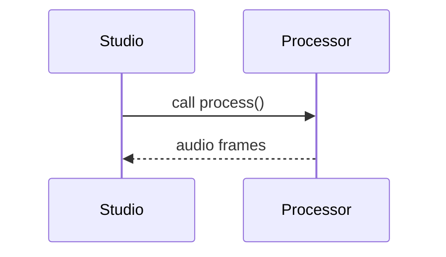

# Processor Guide

Processors perform custom audio worklets or DSP in packages like
[`@opendaw/lib-dsp`](../package-inventory.md#lib).
Combine them with plugins from the [Plugin guide](./plugin-guide.md) for a full
extension.

1. Implement an AudioWorkletProcessor or Box that processes audio buffers.
2. Expose parameters using fields so plugins can control them.
3. Profile performance using the [Profiling guide](../build-and-run/profiling.md).

Review the [openDAW SDK](./opendaw-sdk.md) for shared utilities and best
practices.
