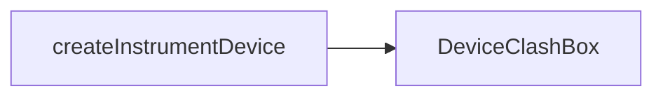

# Device Schemas

Device boxes describe instruments and effects and are built using helper
functions from `schema/devices/builder`.

```mermaid
graph LR
  createInstrumentDevice --> DeviceClashBox
```
