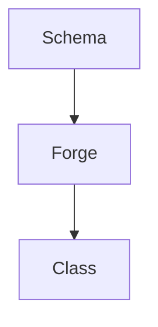

# Forge Boxes Overview

`@opendaw/studio-forge-boxes` hosts the box schemas that describe the
structure of Studio state. The schemas are consumed by the Forge tool to
produce TypeScript classes used at runtime.

