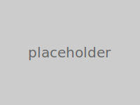

# Performance

openDAW runs entirely in the browser and aims to stay responsive even with
complex projects. Packages like [`@opendaw/lib-dsp`](./package-inventory.md#lib)
and [`@opendaw/app-studio`](./package-inventory.md#app) benefit from regular
profiling. Performance tips for contributors:

- Avoid heavy allocations in the audio thread; prefer pre-allocated buffers.
- Use Web Workers or AudioWorklets for CPU‑intensive tasks.
- Profile with the browser dev tools to spot layout thrashing or long tasks.
- When adding features, measure rendering and audio latency to prevent regressions.

For an overview of engine design choices that influence runtime behaviour, see
the [architecture performance notes](./architecture/performance.md).

## Capturing performance traces in Chrome DevTools

Chrome's Performance panel helps diagnose rendering or audio hiccups. To capture
a trace (see also the [Profiling guide](./build-and-run/profiling.md)):

1. **Open DevTools** – Press `F12` or `Cmd+Option+I` / `Ctrl+Shift+I` in Chrome.
    <!-- TODO: add screenshot -->
2. **Switch to the Performance tab** – Select the _Performance_ tab in the DevTools toolbar.
    <!-- TODO: add screenshot -->
3. **Start recording** – Click the record button (●) or press `Cmd+E` / `Ctrl+E`, then interact with openDAW to reproduce the issue.
    <!-- TODO: add screenshot -->
4. **Stop recording** – Click the stop button or press `Cmd+E` / `Ctrl+E` again. DevTools will process and display the trace.
    <!-- TODO: add screenshot -->
5. **Save the trace (optional)** – Use the export icon to save a `.json` trace file for sharing in pull requests.
    <!-- TODO: add screenshot -->

Contributors are encouraged to document any performance benchmarks or profiling
results in pull requests. Screenshots or trace files greatly help reviewers
understand the impact of a change.
