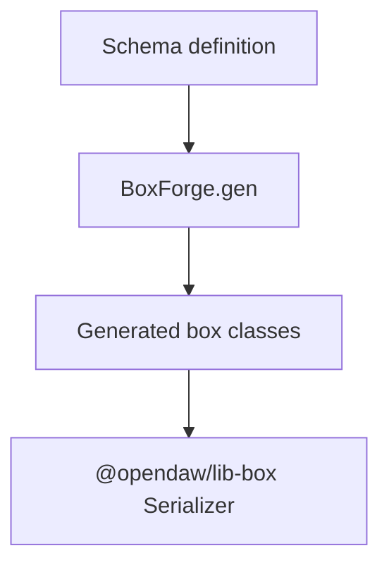

# Box Forge Mapping

`@opendaw/lib-box-forge` compiles schema definitions into concrete box classes.

- See the [package README](../../../lib/box-forge/README.md) for more information.
- Return to the [serialization overview](./overview.md).
