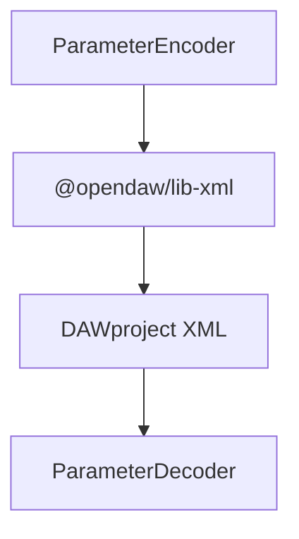

# DAWproject Mapping

`@opendaw/lib-dawproject` bridges openDAW's types to the DAWproject XML schema.

- See the [package README](../../../lib/dawproject/README.md) for usage details.
- Return to the [serialization overview](./overview.md).
