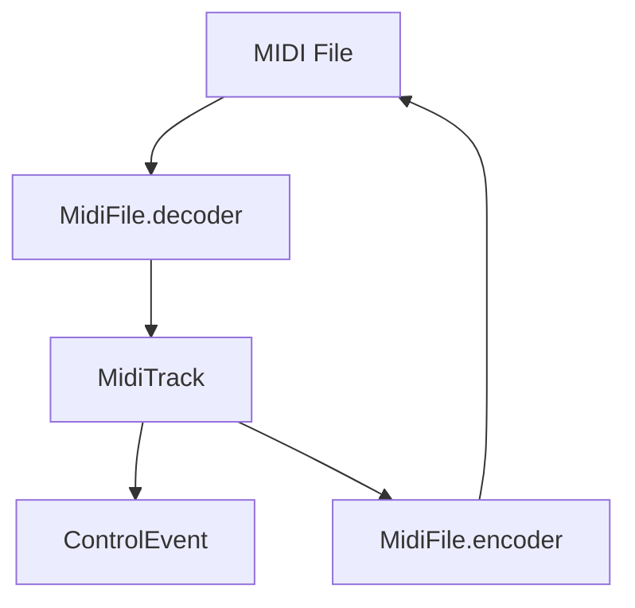

# MIDI Serialization

The `@opendaw/lib-midi` package encodes and decodes Standard MIDI Files.

- See the [package README](../../../lib/midi/README.md) for code samples.
- Return to the [serialization overview](./overview.md).
