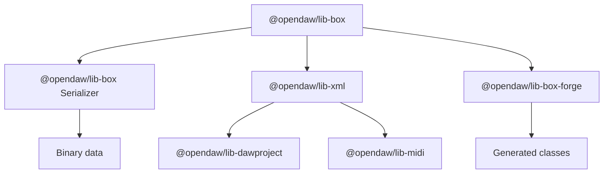

# Serialization Overview

openDAW uses a layered approach to convert structured data into persistent formats.

- [MIDI serialization](./midi.md)
- [DAWproject mapping](./dawproject.md)
- [XML decorators](./xml.md)
- [Box forge schemas](./box-forge.md)
