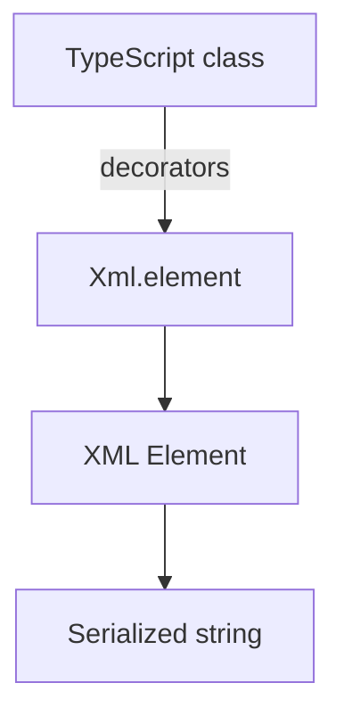

# XML Serialization

`@opendaw/lib-xml` converts decorated classes into XML elements.

- See the [package README](../../../lib/xml/README.md) for a full example.
- Return to the [serialization overview](./overview.md).
