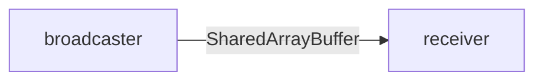

# Live Stream Service

Streams real-time data between workers and the UI using shared memory buffers.

See the user-facing [collaboration feature](../../docs-user/features/collaboration.md) for how this service is used.
