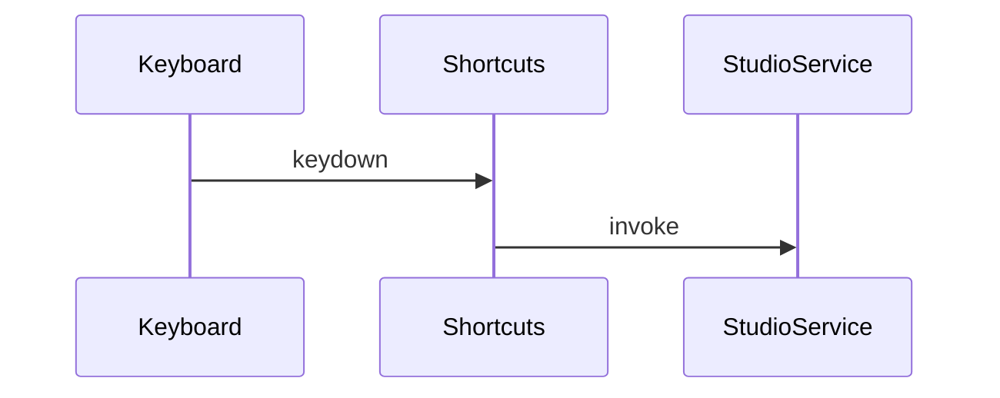

# Shortcuts Service

Global key bindings translate user input into Studio actions.

```mermaid
sequenceDiagram
  participant K as Keyboard
  participant S as Shortcuts
  participant SS as StudioService
  K->>S: keydown
  S->>SS: invoke
```
