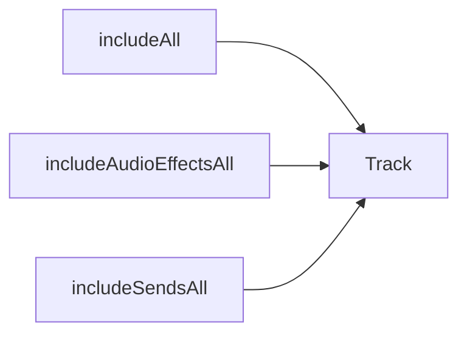

# Stems Configurator

`ExportStemsConfigurator` allows users to choose which tracks to render as
individual stems and how each stem should be named. It is used by the export
workflow when the *Stems* option is selected.

See the [exporting and sharing workflow](../../docs-user/workflows/exporting-and-sharing.md)
for an overview of how stems fit into project delivery.
