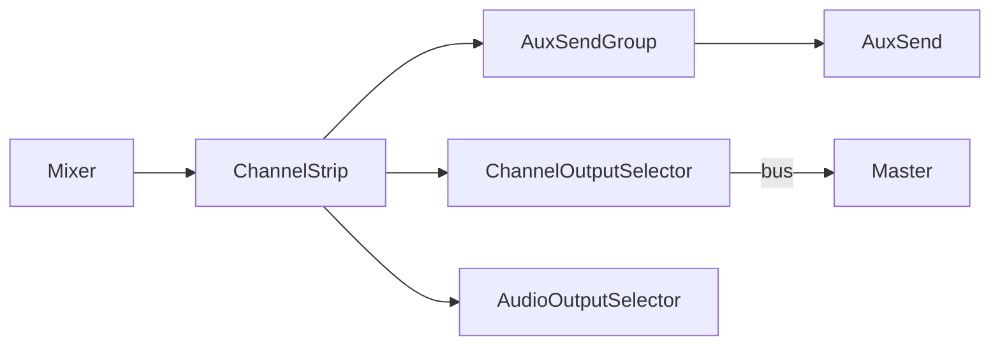

# Mixer UI

Developer overview of mixer-related components.

## Components

- `Mixer` – container that lays out channel strips and manages scrolling.
- `ChannelStrip` – represents a track or bus with controls for level, pan and routing.
- `AuxSend` and `AuxSendGroup` – provide send levels to auxiliary busses.
- `ChannelOutputSelector` and `AudioOutputSelector` – choose output busses or hardware devices.
- `AudioOutputDevices` – lists available hardware devices for selection.
- `DevicePanel` and `DevicePeakMeter` – host editors and metering for selected devices.

### Routing diagram

This structure allows the mixer to manage complex routing between tracks, busses and external devices while keeping components isolated.
