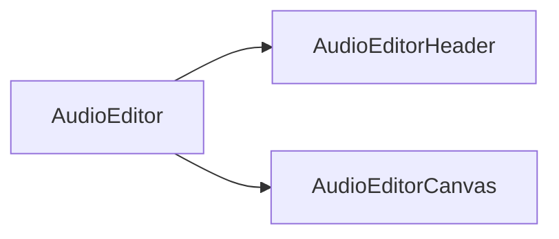

# Audio Editing

Developer notes for the timeline's audio editing features. The audio editor
consists of a header providing future transport controls and a canvas
rendering the waveform of the selected clip.

- **AudioEditor** assembles header and canvas.
- **AudioEditorHeader** will host transport and zoom controls.
- **AudioEditorCanvas** draws the waveform and loop region.

Clip management in the timeline is handled by dedicated components as outlined
in [clips](./clips.md).

