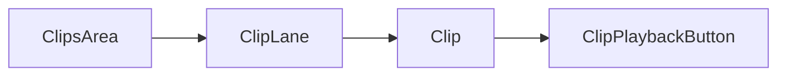

# Timeline Clips

The clip components render and control individual clip instances on the timeline.

- **ClipsArea** manages selection, drag and drop and context menus for clips.
- **ClipLane** hosts placeholder cells for a track's clips.
- **Clip** paints the clip preview and tracks playback state.
- **ClipPlaybackButton** provides a play/stop overlay on the clip.

