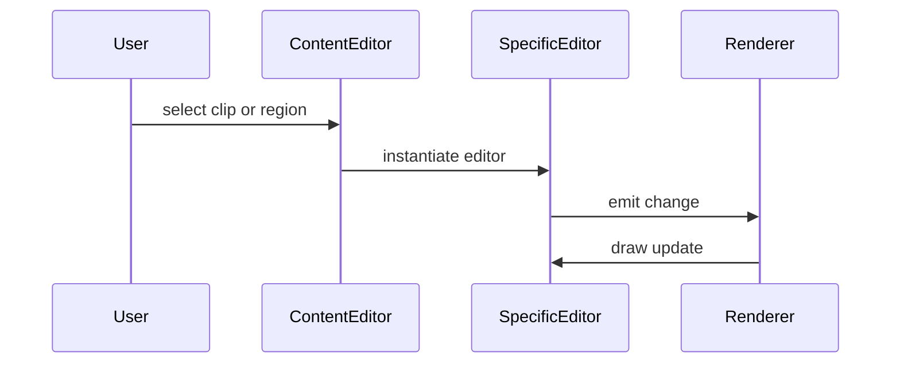

# Timeline Editors

The timeline features multiple editor implementations for different kinds of content.
`ContentEditor` acts as the coordinator, swapping in audio, note or value editors
based on the selected region or clip. Shared tools such as the time axis and
snapping selector are provided once and reused by the specialised editors.

The diagram illustrates how user interaction travels from the timeline through an
editor to the rendering pipeline.
