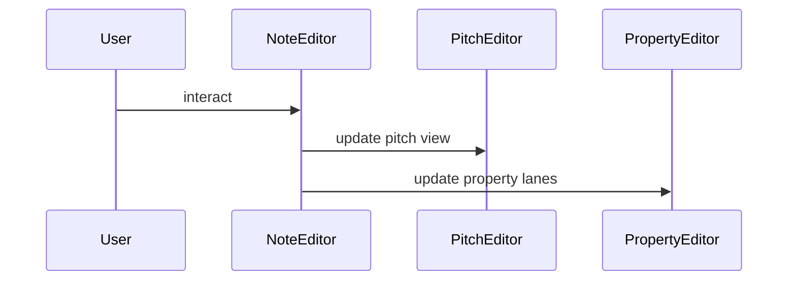

# Note Editor

Coordinates pitch and property views to edit MIDI notes.

- **NoteEditor** wires pitch and property editors with selection and menus.
- **PitchEditor** displays notes on a piano roll grid.
- **PropertyEditor** shows velocity and other controllers.
