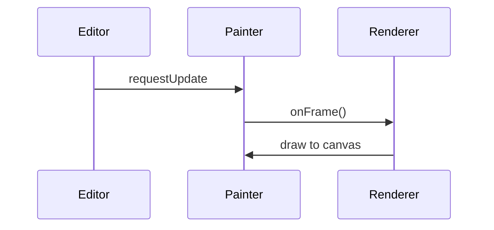

# Timeline Performance

Timeline editors request rendering through a `CanvasPainter` which batches
updates and draws only the visible portion of a region. This avoids expensive
full‑canvas redraws while the user interacts with clips.

Minimising work per frame keeps interaction responsive even with complex
automation curves or dense note regions.
