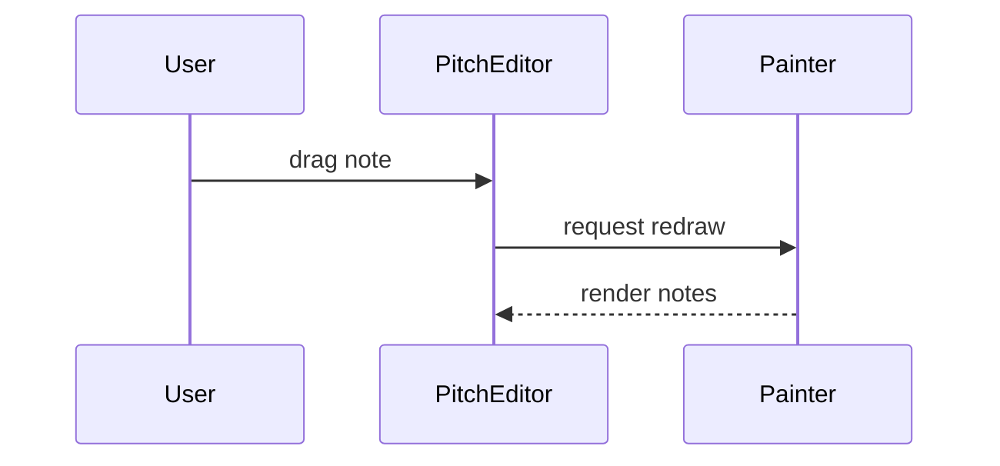

# Pitch Editor

Canvas driven interface for manipulating note pitch and timing.

- **PitchEditor** handles event capturing and selection.
- **Painter** draws notes, scales and guides to the canvas.
