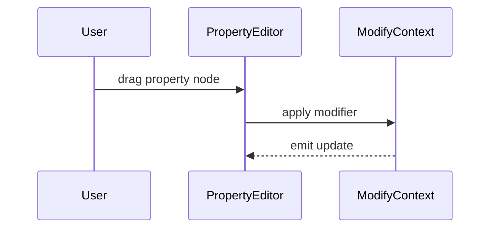

# Property Editor

Displays and edits per-note properties such as velocity or modulation.

- **PropertyEditor** hosts draggable property nodes for the selection.
- **ModifyContext** manages undoable changes while editing.
