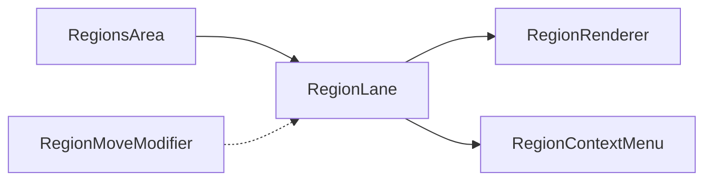

# Timeline Regions

Regions are drawn on a canvas and support rich editing operations.

- **RegionsArea** contains the region lanes for each track.
- **RegionLane** renders a track's regions and handles visibility.
- **RegionRenderer** draws the region content on the canvas.
- **RegionContextMenu** exposes actions such as rename or convert.
- **RegionMoveModifier** updates previews while regions are moved.

