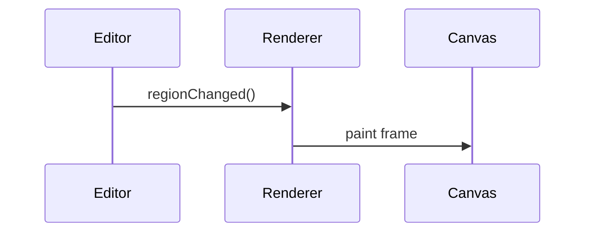

# Timeline Renderers

Renderer modules turn editor state into visual output on the timeline canvas.
Dedicated functions handle audio waveforms, MIDI notes and value automation.

- `renderAudio` draws waveform peaks for audio regions.
- `renderNotes` renders note blocks for MIDI regions.
- `renderValueStream` plots automation curves.
- `renderTimeGrid` adds the background grid used for snapping.
