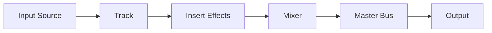

# DAW Basics 101

A Digital Audio Workstation (DAW) is software for recording, editing, and mixing audio. It lets you capture performances, arrange clips on a timeline, and apply effects to shape the final sound.

## Core Concepts

- **Tracks** – containers for audio or MIDI data that you can record, edit, and process.
- **Timeline** – the horizontal workspace where clips are arranged in time.
- **Mixer** – combines tracks, sets their levels, and routes them to outputs.
- **Plug-ins** – processors or instruments inserted on tracks to modify or generate sound.
- **Automation** – recorded changes to parameters such as volume or effect settings over time.

## Signal Flow

Audio moves from an input source through processing stages to the final output. Understanding this path helps in troubleshooting and designing sessions.

## Next Steps

Continue to the next lesson to learn how to create tracks, record audio, and use basic effects.

## Quiz

1. What component combines tracks and controls their levels?
   - [ ] Timeline
   - [x] Mixer
   - [ ] Automation lane
2. Automation is used to record changes to parameters over what?
   - [ ] Frequency
   - [ ] File size
   - [x] Time

