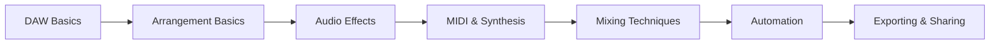

# Learning Hub

The learning hub gathers tutorials and background material for openDAW.
Start with **[DAW Basics 101](./daw-basics-101.md)** to learn core concepts
like tracks, the mixer, and automation. Lessons build on each other, so work
through them in order or jump to topics using the sidebar. Upcoming lessons
are outlined in the [project roadmap](../../../ROADMAP.md).

Interested in contributing lessons? Check the
[Writing Guide](../docs-dev/style/writing-guide.md) for style tips.



## Lessons

- [Audio Effects and Signal Chain](./lessons/audio-effects-and-signal-chain.md)
- [MIDI and Synthesis](./lessons/midi-and-synthesis.md)
- [Arrangement Basics](./lessons/arrangement-basics.md)
- [Mixing Techniques](./lessons/mixing-techniques.md)
- [Automation](./lessons/automation.md)
- [Exporting and Sharing](./lessons/exporting-and-sharing.md)
- [Latency and Buffers](./how-it-works/latency-and-buffers.md)
- [Storage Model](./how-it-works/storage-model.md)

Each page includes links to the next step so you can follow a continuous
learning path or explore individual subjects as needed.

## Quiz

1. Which lesson covers balancing levels and EQ?
   - [ ] Arrangement Basics
   - [x] Mixing Techniques
   - [ ] Storage Model
2. Which topic shows how to share your finished track?
   - [ ] MIDI and Synthesis
   - [ ] Latency and Buffers
   - [x] Exporting and Sharing

## Build from Source

Run these commands from the repository root if you want to contribute lessons or code:

```bash
npm run install:deps
npm install
npm run build
npm test
npm run docs:dev    # local docs preview
npm run docs:build  # static docs output
```
