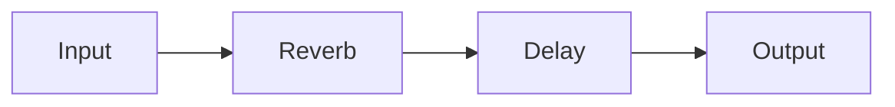

# Audio Effects and Signal Chain

Adding effects to a track lets you shape its sound and polish a mix. Follow these steps to insert an effect and understand how signals flow through your chain.

## Add an Effect

1. **Select a track.** Click the track header to highlight it.  
   
2. **Open the effects panel.** Press the _Effects_ tab or use the shortcut `E`.  
   
3. **Choose _Add Effect_.** A list of available processors appears.  
   
4. **Pick an effect type.** For example, select _Reverb_ from the list.  
   
5. **Tweak parameters.** Adjust knobs or sliders while listening to the result.  
   

## Simple Signal Chain

The order of effects matters: each processor modifies the signal before passing it along. Here's a basic chain with two effects:

Experiment by reordering effects to discover new textures.
