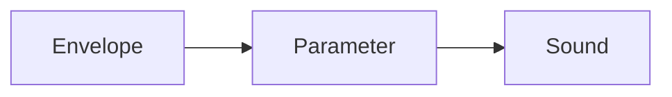

# Automation

Automation records parameter changes so they play back exactly as performed.

## Envelope Flow

## Quiz

1. Automation data changes a parameter over what?
   - [x] Time
   - [ ] File size
   - [ ] Tempo only
2. Where can you edit automation in openDAW?
   - [ ] The export window
   - [x] An automation lane
   - [ ] The audio hardware

