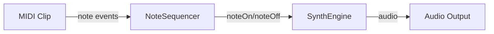

# MIDI and Synthesis

MIDI clips contain note data that tells instruments what to play. When a clip enters the playback cursor, openDAW's engine reads each note and forwards it to the synth assigned to the track.

## How MIDI clips trigger synths

During playback the engine's `NoteSequencer` iterates over all notes in a clip and broadcasts `noteOn`/`noteOff` messages to the synth's voice manager:

```ts
// packages/studio/core-processors/src/NoteSequencer.ts
const event = NoteLifecycleEvent.startWith(source, position + delta);
this.#retainer.addAndRetain({...event});
this.#noteBroadcaster.noteOn(event.pitch);
```

You can also trigger notes programmatically through the engine API:

```ts
import {Engine} from '@opendaw/studio-core';

// Play a middle C with full velocity on a synth
engine.noteOn(synthId, 60, 1.0);
// Later, release the note
engine.noteOff(synthId, 60);
```

## MIDI event flow



## Hands-on: Program a Synth Melody

1. **Create a MIDI track** – In the track list choose _Add Track → Instrument_. An empty instrument track appears.
2. **Add a synthesizer** – Open the Device Panel for the new track and load a built‑in synth such as _Simple Synth_.
3. **Draw a MIDI clip** – In the timeline drag to create a region, then double‑click it to open the piano roll.
4. **Enter notes** – Click within the piano roll to place a few notes. Press _Space_ to hear them.
5. **Shape the sound** – Adjust oscillator waveforms, filter cutoff and envelope controls in the synth UI. Listen to how the tone changes.
6. **Experiment further** – Change note lengths, velocities or instrument presets to explore how MIDI data affects synthesis.

By sending MIDI messages to a synth and tweaking its parameters you build an intuitive understanding of how electronic instruments create sound.

## Quiz

1. What does a MIDI clip contain?
   - [x] Note data
   - [ ] Audio samples
   - [ ] Effect presets
2. Which message tells a synth to start playing a note?
   - [ ] noteOff
   - [x] noteOn
   - [ ] velocityChange

