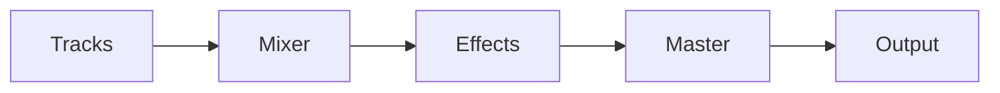

# Mixing Techniques

Mixing balances the elements of a project so that they work together.

## Signal Flow

## Quiz

1. What component controls the level of each track in a mix?
   - [x] Mixer fader
   - [ ] Arrangement view
   - [ ] Export dialog
2. Which processor shapes the frequency content of audio?
   - [x] Equaliser (EQ)
   - [ ] MIDI sequencer
   - [ ] File browser

