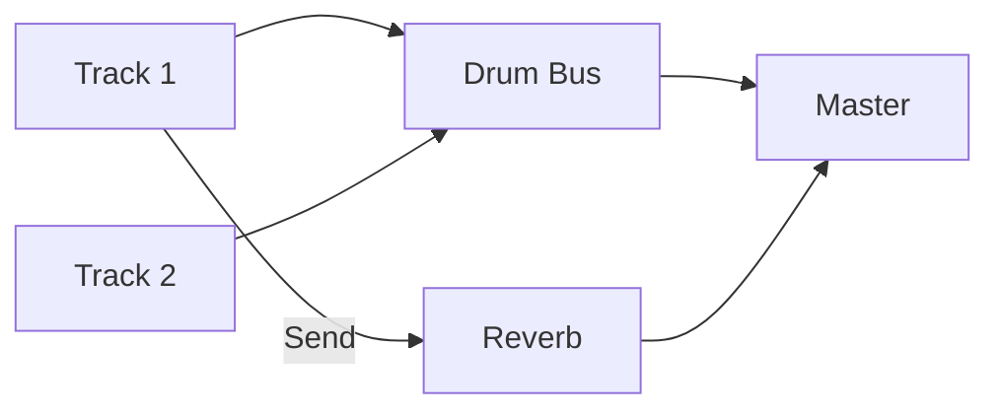

# Mixer

Control levels and routing between tracks and devices.

## Channel strips

Each track is represented by a channel strip containing controls for volume,
pan, mute and solo. Insert slots let you add effects, and send knobs make it
easy to route the signal elsewhere. Adjusting a strip's fader changes the level
that continues to the next stage in the mix.

### Muting and soloing

Use the **mute** button to silence a track without removing it from the mix.
Toggling **solo** isolates one or more tracks while temporarily muting the rest
so you can focus on specific parts of the arrangement.

## Sends and returns

Sends on each channel allow a portion of the signal to be routed to return
tracks. Returns can host time‑based effects like reverbs or delays, and their
outputs are mixed back into the main bus. Sends can be configured as
pre‑ or post‑fader depending on the desired behavior.

## Meter behavior

Channel strips display peak and RMS meters so you can monitor levels at a
glance. Peak meters react instantly to transients while RMS meters average
energy over time to reflect perceived loudness. Meters glow red when clipping
occurs, helping you manage gain staging across the project.

## Routing through a bus

You can group tracks together by routing them through a bus:

1. Create a new bus track, for example **Drum Bus**.
2. In each drum track's channel strip, set the output to **Drum Bus** rather
   than the master.
3. Add effects on the **Drum Bus** track and adjust its level to blend with the
   rest of the mix.

This setup lets you process and control multiple tracks as one while preserving
individual sends and automation.

### Signal routing diagram

For a practical example see the [Mixing workflow](../workflows/mixing.md).

## Changing track outputs

Each channel strip provides an **Output** selector at its base. Use it to route a
track to another bus or directly to a hardware output. The menu lists existing
destinations and also lets you create new busses on the fly.

### Output devices

The master channel can target any detected audio device. Open the output menu
and choose from the **Audio Output Devices** list to switch playback to a
different interface such as external speakers or headphones.

