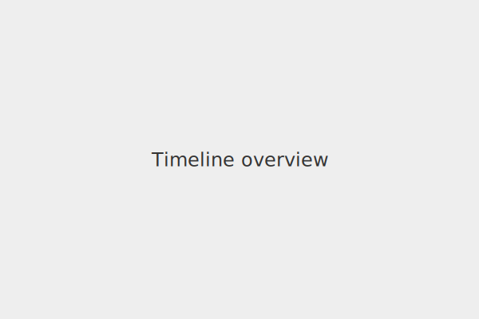
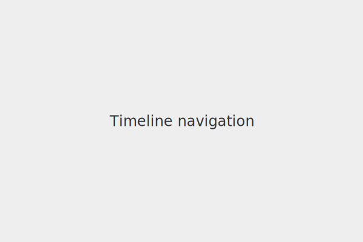
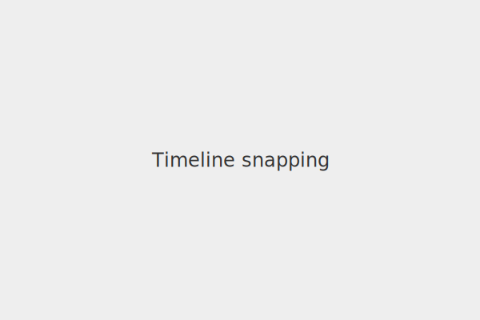

# Timeline

Arrange clips against musical time and control playback.



## Navigation

Use the loop brace and time axis to scroll or set the play range.



## Snapping

Enable snapping to align edits to the musical grid.



## Selection

Drag the mouse to draw a rectangle and select multiple clips or regions.
Use the keyboard to delete the selection or press <kbd>Ctrl</kbd>+<kbd>A</kbd>
to select everything on the timeline.

## Gestures

Drag handles on the navigation bar to resize the visible range. Double-click
the end marker on the time axis to set the project length. Scroll the mouse
wheel over the time axis to zoom and pan.

## Example Integration

```ts
import {CanvasUnitPainter, LinearScale} from "@opendaw/app-studio/ui/canvas";

const painter = new CanvasUnitPainter(
    canvas,
    new LinearScale(0, timeline.length),
    new LinearScale(0, 1),
    p => {
        const ctx = p.context;
        ctx.clearRect(0, 0, p.actualWidth, p.actualHeight);
        // draw custom timeline markers here
    }
);
```

### Developer Documentation

Further implementation details are covered in the developer docs for
[timeline tracks](../../docs-dev/ui/timeline/tracks.md),
[markers](../../docs-dev/ui/timeline/markers.md) and the
[timeline footer](../../docs-dev/ui/timeline/footer.md).
