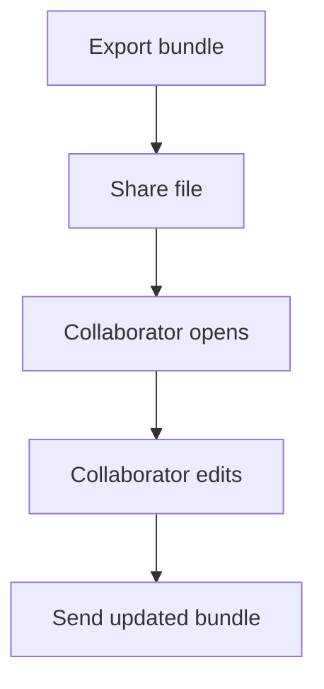

# Collaboration Workflow

Work with others by exchanging project bundles.

1. **Export a project bundle.** From _File → Export_ choose **Project Bundle** to create an `.odb` file.
2. **Share the file.** Send the bundle via cloud storage or messaging.
3. **Open and edit.** Collaborators choose _File → Open_ to load the bundle and make changes.
4. **Return updates.** They export a new bundle and send it back.
5. **Merge or replace.** Import the updated file into your session or keep versions separately.

See [File Management](../features/file-management.md) for details on saving and storage.
